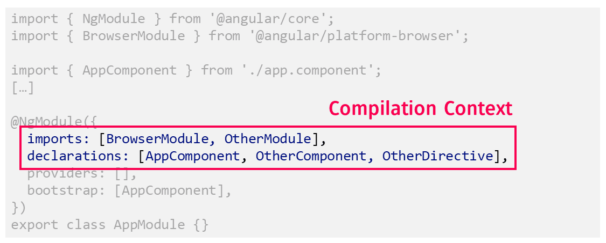
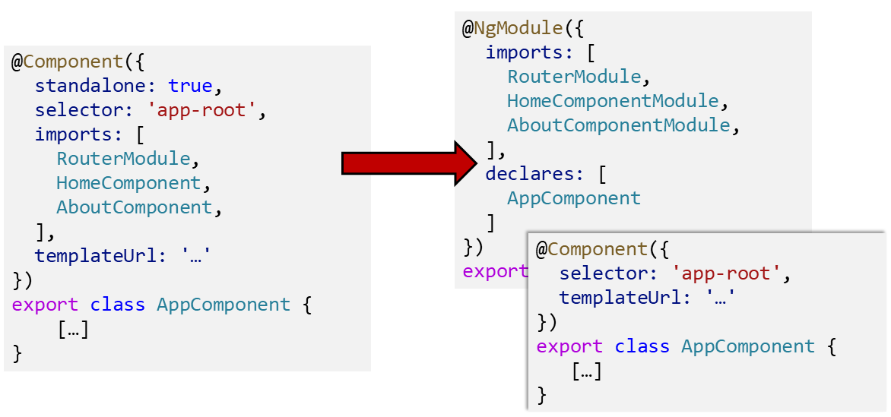

# Автономные компоненты

<big>**Автономные компоненты** (Standalone Components) — одна из самых интересных новых возможностей Angular с недавних пор. Они позволяют работать без `NgModules` и, следовательно, являются ключом к более легким и простым решениям Angular.</big>

В этой книге я собираюсь продемонстрировать, как использовать это нововведение. Для этого я использую пример приложения, полностью написанного на Standalone Components.

!!!note "Исходный код"

    Исходный код для этого можно найти в виде традиционного [Angular CLI workspace](https://github.com/manfredsteyer/standalone-example-cli) и в виде [Nx workspace](https://github.com/manfredsteyer/standalone-example-nx), который использует библиотеки в качестве замены NgModules.

## Почему мы вообще запустили NgModules? {#leanpub-auto-why-did-we-even-get-ngmodules-in-the-first-place}

Основная причина появления NgModules изначально была прагматичной: Нам нужен был способ группировки строительных блоков, которые используются вместе. Не только для повышения удобства разработчиков, но и для компилятора Angular, развитие которого немного отставало. В последнем случае мы говорим о контексте компиляции. Из этого контекста компилятор узнает, где в программном коде разрешено вызывать те или иные компоненты:



Однако сообщество так и не пришло в восторг от этого решения. Наличие еще одной модульной системы, помимо EcmaScript, казалось неправильным. Кроме того, это повышало входной барьер для начинающих разработчиков Angular. Поэтому команда Angular разработала новый компилятор Ivy таким образом, чтобы скомпилированное приложение работало без модулей во время выполнения. Каждый компонент, скомпилированный с помощью Ivy, имеет свой собственный контекст компиляции. Даже если это звучит грандиозно, этот контекст просто представлен двумя массивами, которые ссылаются на соседние компоненты, директивы и пайпы.

Поскольку старый компилятор и связанная с ним среда выполнения были окончательно удалены из Angular начиная с Angular 13, пришло время закрепить эту возможность в публичном API Angular. В течение некоторого времени существовал проектный документ и связанный с ним RFCRFC. Оба документа описывают мир, в котором модули Angular являются опциональными. Слово "опциональные" здесь очень важно: Существующий код, который опирается на модули, по-прежнему поддерживается.

## Начало работы с автономными компонентами {#leanpub-auto-getting-started-with-standalone-components}

В целом, реализовать автономный компонент очень просто. Просто установите флаг `standalone` в декораторе `Component` на `true` и импортируйте все, что вы хотите использовать:

```ts
@Component({
    standalone: true,
    selector: 'app-root',
    imports: [
        RouterOutlet,
        NavbarComponent,
        SidebarComponent,
    ],
    templateUrl: './app.component.html',
    styleUrls: ['./app.component.css'],
})
export class AppComponent {
    // [...]
}
```

Параметр `imports` определяет контекст компиляции: все другие строительные блоки, которые может использовать Standalone Components. Например, с помощью этого параметра можно импортировать не только Standalone Component, но и существующие NgModules.

Исчерпывающее перечисление всех этих строительных блоков делает компонент самодостаточным и, таким образом, повышает возможность его повторного использования в принципе. Это также заставляет нас задуматься о зависимостях компонента. К сожалению, эта задача оказывается крайне монотонной и трудоемкой.

Поэтому есть соображения по поводу реализации своего рода автоимпорта в Angular Language Service, используемом IDE. По аналогии с автоимпортом для модулей TypeScript, выбранная IDE могла бы также предлагать поместить соответствующую запись в массив `imports` при первом использовании компонента, пайпа или директивы в шаблоне.

## Ментальная модель {#leanpub-auto-the-mental-model}

Ментальная модель помогает лучше понять Standalone Components. В общем, вы можете представить себе автономный компонент как компонент с собственным модулем NgModule:



Это похоже на паттерн SCAM [Lars Nielsen](https://twitter.com/LayZeeDK). Однако если в SCAM используется явный модуль, то здесь мы говорим только о мысленном модуле.

Хотя эта ментальная модель полезна для понимания поведения Angular, важно также видеть, что Angular не реализует автономные компоненты таким образом.

## Пайпы, директивы и службы {#leanpub-auto-pipes-directives-and-services}

Аналогично автономным компонентам, существуют автономные пайпы и автономные директивы. Для этого декораторы `pipe` и `directive` также получают свойство `standalone`. Вот как будет выглядеть автономный пайп:

```ts
@Pipe({
    standalone: true,
    name: 'city',
    pure: true,
})
export class CityPipe implements PipeTransform {
    transform(value: string, format: string): string {
        /* […] */
    }
}
```

А вот пример для автономной директивы:

```ts
@Directive({
    standalone: true,
    selector: 'input [appCity]',
    providers: [
        /* … */
    ],
})
export class CityValidator implements Validator {
    /* [...] */
}
```

С другой стороны, благодаря древовидным провайдерам сервисы уже давно работают без модулей. Для этого необходимо использовать свойство `providedIn`:

```ts
@Injectable({
    providedIn: 'root',
})
export class FlightService {
    /* […] */
}
```

Команда Angular рекомендует использовать `providedIn: 'root'` всегда, когда это возможно. Это может быть неожиданностью, но `providedIn: 'root'` также работает с ленивой загрузкой: Если вы используете сервис только в ленивых частях вашего приложения, он будет загружен вместе с ними.

## Загрузка автономных компонентов {#leanpub-auto-bootstrapping-standalone-components}

До сих пор для бутстрапинга требовались модули, тем более что Angular ожидал наличия модуля с бутстрап-компонентом. Таким образом, этот так называемый `AppModule` или "корневой модуль" определял основной компонент вместе с его контекстом компиляции.

С помощью Standalone Components можно будет загружать отдельный компонент. Для этого Angular предоставляет метод `bootstrapApplication`, который можно использовать в файле `main.ts`:

```ts title="main.ts"
import { bootstrapApplication } from '@angular/platform-browser';
import { provideAnimations } from '@angular/platform-browser/animations';
import { AppComponent } from './app/app.component';
import { APP_ROUTES } from './app/app.routes';
import { provideRouter } from '@angular/router';
import { importProvidersFrom } from '@angular/core';

// [...]

bootstrapApplication(AppComponent, {
    providers: [
        importProvidersFrom(HttpClientModule),
        provideRouter(APP_ROUTES),
        provideAnimations(),
        importProvidersFrom(TicketsModule),
        importProvidersFrom(LayoutModule),
    ],
});
```

Первым аргументом, передаваемым `bootstrapApplication`, является основной компонент. В данном случае это наш `AppComponent`. Через второй аргумент мы передаем провайдеров сервисов для всего приложения. Это провайдеры, которые вы зарегистрируете в `AppModule` при работе с NgModules.

Предоставленная вспомогательная функция `importProvidersFrom` позволяет преодолеть разрыв с существующими NgModules. Обратите внимание, что `importProvidersFrom` работает как с NgModules, так и с `ModuleWithProviders`, возвращаемыми такими методами, как `forRoot` и `forChild`.

Хотя это позволяет сразу же использовать существующие API на основе NgModule, в будущем мы увидим все больше и больше функций, которые заменят использование `importProvidersFrom`. Например, для регистрации маршрутизатора с заданной конфигурацией используется функция `provideRouter`. Аналогично, provideAnimations настраивает модуль Animation.

## Совместимость с существующим кодом {#leanpub-auto-compatibility-with-existing-code}

Как говорилось выше, согласно ментальной модели, автономный компонент — это просто компонент с собственным модулем NgModule. Это также является ключом к совместимости с существующим кодом, все еще использующим NgModules.

С одной стороны, мы можем импортировать целые NgModules в автономный компонент:

```ts
import { Component, OnInit } from '@angular/core';
import { TicketsModule } from '../tickets/tickets.module';

@Component({
    selector: 'app-next-flight',
    standalone: true,
    imports: [
        // Existing NgModule imported
        // in this standalone component
        TicketsModule,
    ],
})
export class NextFlightComponent implements OnInit {
    /* [...] */
}
```

Но с другой стороны, мы также можем импортировать отдельный компонент (директиву, пайп) в существующий модуль NgModule:

```ts
@NgModule({
    imports: [
        CommonModule,

        // Imported Standalone Component:
        FlightCardComponent,
        /* [...] */
    ],
    declarations: [MyTicketsComponent],
    /* [...] */
})
export class TicketsModule {}
```

Интересно, что автономные компоненты **импортируются**, как модули, а не объявляются, как классические компоненты. На первый взгляд это может сбить с толку, но это полностью соответствует ментальной модели, которая рассматривает отдельный компонент как компонент с собственным NgModule.

Кроме того, объявление традиционного компонента определяет сильную связь "целое-часть": Традиционный компонент может быть объявлен только в одном модуле, и тогда он принадлежит этому модулю. Однако автономный компонент не принадлежит ни одному модулю NgModule, но может быть повторно использован в нескольких местах. Следовательно, использование `imports` здесь действительно имеет смысл.

## Побочное примечание: модуль CommonModule {#leanpub-auto-side-note-the-commonmodule}

Несомненно, одним из самых известных NgModules в Angular является `CommonModule`. Он содержит встроенные директивы типа `*ngIf` или `*ngFor` и встроенные пайпы типа `async` или `json`. Хотя вы все еще можете импортировать весь `CommonModule`, тем временем можно импортировать только необходимые директивы и пайпы:

```ts
import {
    AsyncPipe,
    JsonPipe,
    NgForOf,
    NgIf,
} from '@angular/common';

// [...]

@Component({
    standalone: true,
    imports: [
        // CommonModule,
        NgIf,
        NgForOf,
        AsyncPipe,
        JsonPipe,

        FormsModule,
        FlightCardComponent,
        CityValidator,
    ],
    selector: 'flight-search',
    templateUrl: './flight-search.component.html',
})
export class FlightSearchComponent implements OnInit {
    /* [...] */
}
```

Это возможно, потому что команда Angular сделала автономные директивы и автономные пайпы из строительных блоков, предоставляемых `CommonModule`. Импорт этих строительных блоков будет особенно интересен, когда IDE обеспечат автоимпорт для автономных компонентов. В этом случае первое использование такого строительного блока, как `*ngIf`, заставит IDE добавить его в массив `imports`.

> Как мы увидим в следующей части этой книги, тем временем `RouterModule` также поставляется с автономными блоками. Таким образом, мы можем напрямую импортировать RouterOutlet вместо того, чтобы использовать весь `RouterModule`. На момент написания статьи это еще не было возможно для других модулей, таких как `FormsModule` или `HttpClientModule`.

## Заключение {#leanpub-auto-conclusion}

Итак, мы рассмотрели, как использовать автономные компоненты, чтобы сделать наши приложения Angular более легковесными. Мы также увидели, что лежащая в основе ментальная модель гарантирует совместимость с существующим кодом.

Однако теперь возникает вопрос, как все это повлияет на структуру и архитектуру нашего приложения. Следующая глава прольет на это свет.
